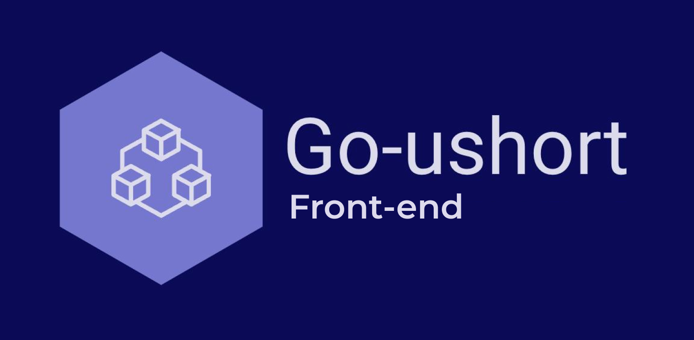

<p align="center">
 
</p>

<!-- [](https://github.com/WenzzyX/frontend-ushort/actions/workflows/ci-cd.production.yml) -->

&nbsp;\
My pet project that shortens long links ;)\
&nbsp;\
Back-end: [go-ushort](https://github.com/WenzzyX/go-ushort)
&nbsp;\
&nbsp;\
_`https://very-long-site-subdomain.long-domain-ffff.com/my-best-blog`_ \
-> `https://ushort.bio/g32d` \
_ushort.bio - is not my domain, it's just an example_

## Todo

- [x] Layout
- [x] Authorization (next-auth with refresh token)
- [x] Configure interceptors for axios
- [x] Add pages for CRUD operations with links
- [x] Add Dockerfile
- [ ] Add CI-CD pipeline (_in progress_)
- [ ] Configure deploy (vercel)
- [ ] Write tests

### General

```shell
yarn dev
# Run nextjs app in development mode
```

```shell
yarn build
# build for production
```

```shell
docker build . \
	--platform=linux/amd64 \
	-t frontend-ushort \
	--build-arg NEXT_PUBLIC_USHORT_DOMAIN="ushort.bio"
# build for amd64

docker build . \
	-t frontend-ushort \
	--build-arg NEXT_PUBLIC_USHORT_DOMAIN="ushort.bio"
# build docker image
```

```shell
docker run -d --rm -p 80:3000 \
	--name frontend-ushort \
	-e NEXTAUTH_SECRET="test-secret" \
	-e NEXTAUTH_URL="http://localhost" frontend-ushort
# run docker container
```

### Environment

#### Client side

| param                       | type     | required | default | description                                    |
| --------------------------- | -------- | -------- | ------- | ---------------------------------------------- |
| `NEXT_PUBLIC_USHORT_DOMAIN` | `string` | `yes`    | `-`     | Backend (go-ushort) domain (ex.: "ushort.bio") |

&nbsp;\
&nbsp;

#### Server side

| param             | type     | required | default | description                                  |
| ----------------- | -------- | -------- | ------- | -------------------------------------------- |
| `NEXTAUTH_SECRET` | `string` | `yes`    | `-`     | Secret for generating session-token          |
| `NEXTAUTH_URL`    | `string` | `yes`    | `-`     | Base front-end url (ex.: "http://localhost") |
